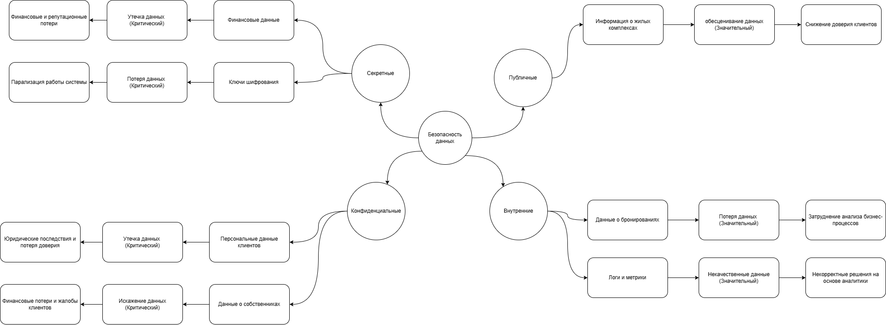

### Классификация данных по стандартам ISO/IEC 27001 и 27002

* Публичные данные:
    + Информация о жилых комплексах
    + Общая информация о компании
    + Условия использования сервисов

* Внутренние данные:
    + Данные о бронированиях и сделках
    + Отчёты о работе сервисов
    + Внутренние документы

* Конфиденциальные данные:
    + Персональные данные клиентов
    + Данные о собственниках 
    + Данные о партнёрах

* Секретные данные:
    + Финансовые данные
    + Коды доступа, ключи шифрования.
    + Данные о внутренних уязвимостях системы.

### Определение рисков для каждой категории данных

* Публичные данные
    + Риск: обесценивание данных.
        - Если публичные данные будут искажены или утеряны, это может привести к снижению доверия клиентов и ухудшению репутации компании.
        - Оценка: Значительный.

* Внутренние данные
    + Риск: потеря данных.
        - Потеря внутренних данных может затруднить анализ и оптимизацию бизнес-процессов.
        - Оценка: Значительный.

    + Риск: некачественные данные.
        - Некачественные данные могут привести к некорректным решениям на основе аналитики.
        - Оценка: Значительный.

* Конфиденциальные данные
    + Риск: утечка данных.
        - Утечка персональных данных клиентов или собственников может привести к юридическим последствиям и потере доверия.
        - Оценка: Критический.

    + Риск: искажение данных.
        - Искажение данных может привести к финансовым потерям и жалобам клиентов.
        - Оценка: Критический.

* Секретные данные
    + Риск: утечка данных.
        - Утечка финансовых данных или ключей шифрования может привести к серьёзным финансовым и репутационным потерям.
        - Оценка: Критический.

    + Риск: потеря данных.
        - Потеря секретных данных может парализовать работу системы.
        - Оценка: Критический.

### Визуализация в виде mindmap

