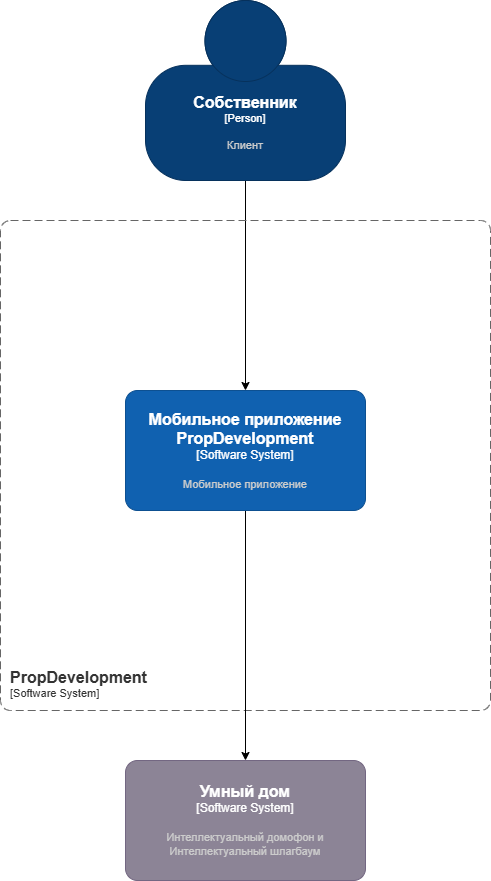
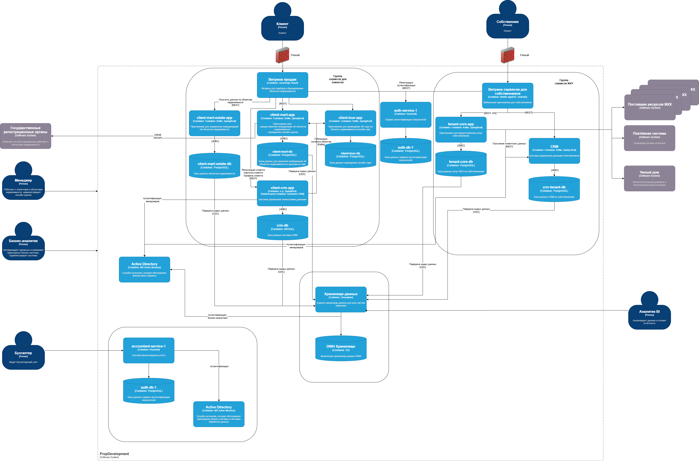

### Требования к внешним интеграциям
* Требования к безопасности
    + Все данные, передаваемые между системами, должны быть зашифрованы с использованием TLS 1.2/1.3
    + Доступ к API партнёрской платформы должен быть ограничен по IP-адресам и API-ключам
    + Все запросы и ответы должны логироваться для последующего анализа

* Протоколы аутентификации и авторизации
    + Аутентификация: OAuth 2.0 с использованием токенов доступа
    + Авторизация: ролевая модель доступа для управления правами пользователей

* Организация взаимодействия
    + Все запросы к партнёрской платформе должны проходить через API Gateway для контроля и мониторинга.
    + Обмен данными должен осуществляться в формате JSON.
    + Ограничение на количество запросов в секунду для предотвращения перегрузки системы.
    + Система должна корректно обрабатывать ошибки и уведомлять пользователей.